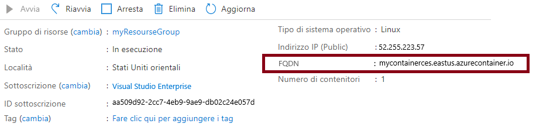
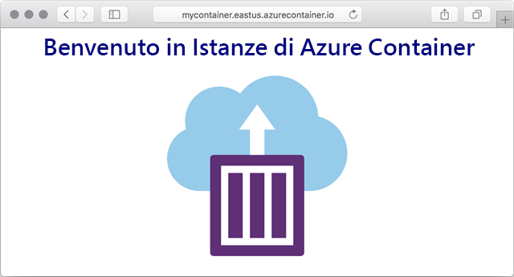

---
wts:
  title: 03. Distribuire Istanze di Azure Container (10 min)
  module: Module 02 - Core Azure Services (Workloads)
ms.openlocfilehash: 0616be96840b14f7580c7d2b16cb43b211c6e3a2
ms.sourcegitcommit: 26c283fffdd08057fdce65fa29de218fff21c7d0
ms.translationtype: HT
ms.contentlocale: it-IT
ms.lasthandoff: 01/27/2022
ms.locfileid: "137908131"
---
# 03. Distribuire Istanze di Azure Container (10 min)

In questa procedura dettagliata verrà illustrato come creare, configurare e distribuire un contenitore tramite Istanze di Azure Container nel portale di Azure. Il contenitore è un'applicazione Web di Benvenuto in Istanze di Azure Container che visualizza una pagina HTML statica. 

# Attività 1: Creare un'istanza di contenitore 

In questa attività verrà creata una nuova istanza di contenitore per l'applicazione Web.  

1. Accedere al [portale di Azure](https://portal.azure.com).

2. Nel pannello **Tutti i servizi** cercare e selezionare **Istanze di Container**, quindi fare clic su **+ Aggiungi, + Crea, + Nuovo**. 

3. Specificare le informazioni di base seguenti per la nuova istanza di contenitore (lasciare i valori predefiniti per tutto il resto): 

    | Impostazione| Valore|
    |----|----|
    | Subscription | ***Usare l'impostazione predefinita fornita*** |
    | Resource group | **Creare un nuovo gruppo di risorse** |
    | Nome contenitore| **mycontainer**|
    | Region | **(Stati Uniti) Stati Uniti orientali** |
    | Origine immagine| **Docker Hub o altro registro**|
    | Tipo di immagine| **Pubblica**|
    | Immagine| **mcr.microsoft.com/azuredocs/aci-helloworld**|
    | Tipo di sistema operativo| **Linux** |
    | Dimensione| ***Lasciare l'impostazione predefinita***|

4. Configurare la scheda Rete (sostituire **xxxx** con lettere e numeri in modo che il nome sia univoco a livello globale). Lasciare i valori predefiniti per tutte le altre impostazioni.

    | Impostazione| Valore|
    |--|--|
    | Etichetta del nome DNS| **mycontainerdnsxxxxx** |

    
    **Nota**: il contenitore sarà raggiungibile pubblicamente all'indirizzo dns-name-label.region.azurecontainer.io. Se dopo la distribuzione si riceve il messaggio di errore **L'etichetta del nome DNS non è disponibile**, specificare un'etichetta del nome DNS diversa (in sostituzione di xxxx) e ripetere la distribuzione. 

5. Fare clic su **Rivedi e crea** per avviare il processo automatico di convalida.

6. Fare clic su **Crea** per creare l'istanza di contenitore. 

7. Monitorare la pagina della distribuzione e la pagina **Notifiche**. 

# Attività 2: Verificare la distribuzione dell'istanza di contenitore

In questa attività si verificherà che la pagina di benvenuto venga visualizzata per essere certi che l'istanza di contenitore sia in esecuzione.

1. Al termine della distribuzione, fare clic sul collegamento **Vai alla risorsa** nel pannello della distribuzione oppure sul collegamento alla risorsa nell'area di notifica.

2. Nel pannello **Panoramica** di **mycontainer** accertarsi che come **Stato** del contenitore sia visualizzato **In esecuzione**. 

3. Individuare il nome di dominio completo (FQDN).

    

2. Copiare il nome FQDN del contenitore in una nuova scheda del Web browser e premere **Invio**. Verrà visualizzata la pagina di benvenuto. 

    

**Congratulazioni** È stato usato il portale di Azure per distribuire correttamente un'applicazione a un contenitore di Istanze di Azure Container.

**Nota**: per evitare costi aggiuntivi, è possibile rimuovere questo gruppo di risorse. Cercare e selezionare il gruppo di risorse, quindi fare clic su **Elimina gruppo di risorse**. Verificare il nome del gruppo di risorse e quindi fare clic su **Elimina**. Monitorare la pagina **Notifiche** per verificare l'avanzamento dell'eliminazione.
