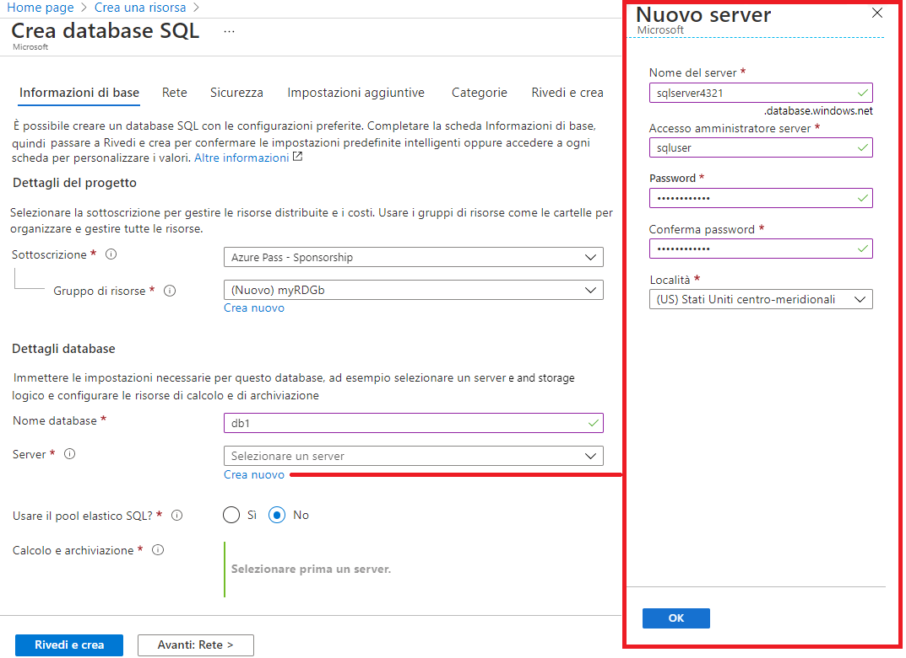
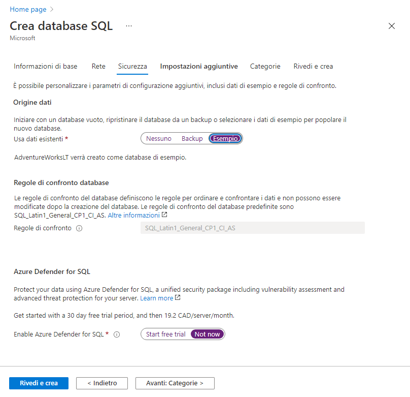
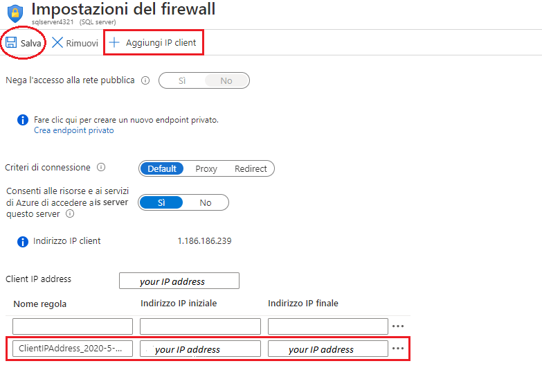

---
wts:
  title: 06. Creare un database SQL (5 min)
  module: Module 02 - Core Azure Services (Workloads)
ms.openlocfilehash: 61a0e7c7b54ed7cd13a9eae427a5b41abc51cffe
ms.sourcegitcommit: 26c283fffdd08057fdce65fa29de218fff21c7d0
ms.translationtype: HT
ms.contentlocale: it-IT
ms.lasthandoff: 01/27/2022
ms.locfileid: "137908130"
---
# <a name="06---create-a-sql-database-5-min"></a>06. Creare un database SQL (5 min)

In questa procedura dettagliata verrà creato un database SQL in Azure e quindi verrà eseguita una query sui relativi dati.

# <a name="task-1-create-the-database"></a>Attività 1: Creare il database 

In questa attività verrà creato un database SQL basato sul database di esempio AdventureWorksLT. 

1. Accedere al portale di Azure all'indirizzo [ **https://portal.azure.com** ](https://portal.azure.com).

2. Nel pannello **Tutti i servizi** cercare e selezionare **Database SQL**, quindi fare clic su **+ Aggiungi, + Crea, + Nuovo**. 

3. Nella scheda **Informazioni di base** inserire le informazioni.  

    | Impostazione | Valore | 
    | --- | --- |
    | Subscription | **Usare l'impostazione predefinita fornita** |
    | Resource group | **Creare un nuovo gruppo di risorse** |
    | Nome database| **db1** | 
    | Server | Selezionare **Crea nuovo** (sulla destra si apre una nuova barra laterale)|
    | Nome server | **sqlserverxxxx** (deve essere univoco) | 
    | Location | **(Stati Uniti) Stati Uniti orientali** |
    | Metodo di autenticazione | **Usare l'autenticazione SQL** |
    | Accesso amministratore server | **sqluser** |
    | Password | **Pa$$w0rd1234** |
    | Fare clic su  | **OK** |

   

4. Passare alla scheda **Rete** e configurare le impostazioni seguenti (lasciare i valori predefiniti per le altre impostazioni) 

    | Impostazione | Valore | 
    | --- | --- |
    | Metodo di connettività | **Endpoint pubblico** |    
    | Consenti alle risorse e ai servizi di Azure di accedere a questo server | **Sì** |
    | Aggiungi indirizzo IP client corrente | **No** |
    
   

5. Nella scheda **Sicurezza**. 

    | Impostazione | Valore | 
    | --- | --- |
    | Microsoft Defender per SQL| **Non ora** |
    
6. Passare alla scheda **Impostazioni aggiuntive**. Verrà usato il database di esempio AdventureWorksLT.

    | Impostazione | Valore | 
    | --- | --- |
    | Usa dati esistenti | **Esempio** |

    

7. Fare clic su **Rivedi e crea** e quindi su **Crea** per distribuire il gruppo di risorse, il server e il database ed effettuarne il provisioning. La distribuzione può richiedere approssimativamente 2-5 minuti.


# <a name="task-2-test-the-database"></a>Attività 2: Testare il database.

In questa attività si configurerà SQL Server e si eseguirà una query SQL. 

1. Al termine della distribuzione, fare clic su Vai alla risorsa nel pannello della distribuzione. In alternativa, nel pannello **Tutte le risorse**, cercare e selezionare **Database**, quindi **Database SQL** per verificare che il nuovo database sia stato creato. Può essere necessario fare clic su **Aggiorna** per aggiornare la pagina.

    

2. Fare clic sulla voce **db1** che rappresenta il database SQL creato. Nel pannello db1, fare clic su **Editor di query (anteprima)** .

3. Eseguire l'accesso come **sqluser** con la password **Pa$$w0rd1234**.

4. Non sarà possibile accedere. Leggere attentamente l'errore e prendere nota dell'indirizzo IP da consentire nel firewall. 

    

5. Nel pannello **db1**, fare clic su **Panoramica**. 

    

6. Nel pannello **Panoramica** del db1, fare clic su **Imposta firewall server** che si trova in alto al centro della schermata Panoramica.

7. Fare clic su **+ Aggiungi IP client** nel menu della barra superiore per aggiungere l'indirizzo IP indicato nel messaggio di errore (potrebbe essere già inserito automaticamente, in caso contrario copiarlo nei campi dell'indirizzo IP). Assicurarsi di **salvare** le modifiche. 

    

8. Tornare al database SQL (far scorrere verso sinistra la barra di attivazione/disattivazione posta in basso) e fare clic su **Editor di query (anteprima)** . Provare di nuovo a eseguire l'accesso come **sqluser** con la password **Pa$$w0rd1234**. Questa volta l'operazione riuscirà. Tenere presente che la distribuzione della nuova regola del firewall può richiedere un paio di minuti. 

9. Una volta effettuato l'accesso, viene visualizzato il riquadro delle query. Immettere la query seguente nel riquadro dell'editor. 

    ```SQL
    SELECT TOP 20 pc.Name as CategoryName, p.name as ProductName
    FROM SalesLT.ProductCategory pc
    JOIN SalesLT.Product p
    ON pc.productcategoryid = p.productcategoryid;
    ```

    

10. Fare clic su **Esegui** e quindi esaminare i risultati della query nel riquadro **Risultati**. La query verrà eseguita correttamente.

    

Congratulazioni! È stato creato un database SQL in Azure ed è stata eseguita correttamente una query sui relativi dati.

**Nota**: per evitare costi aggiuntivi, è possibile rimuovere questo gruppo di risorse. Cercare e selezionare il gruppo di risorse, quindi fare clic su **Elimina gruppo di risorse**. Verificare il nome del gruppo di risorse e quindi fare clic su **Elimina**. Monitorare la pagina **Notifiche** per verificare l'avanzamento dell'eliminazione.
