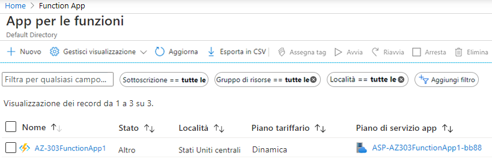
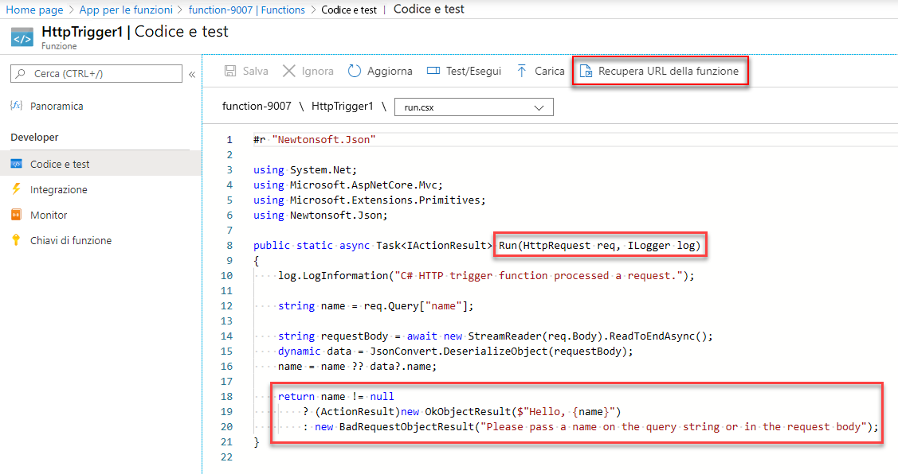
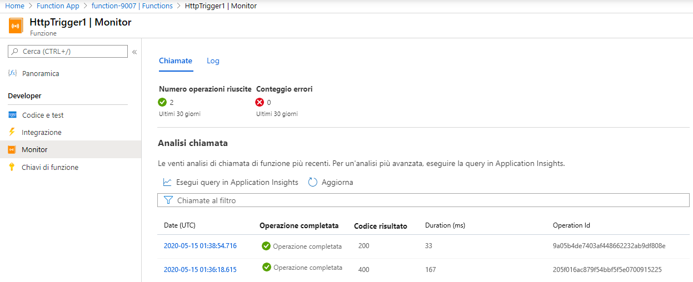

---
wts:
  title: 08. Implementare Funzioni di Azure (5 min)
  module: 'Module 03: Describe core solutions and management tools'
ms.openlocfilehash: 419d49832a4059e447d2621fe4f209dc5ada2474
ms.sourcegitcommit: 26c283fffdd08057fdce65fa29de218fff21c7d0
ms.translationtype: HT
ms.contentlocale: it-IT
ms.lasthandoff: 01/27/2022
ms.locfileid: "137907763"
---
# 08. Implementare Funzioni di Azure (5 min)

In questa procedura dettagliata verrà creata un'app per le funzioni per visualizzare un messaggio di benvenuto quando viene effettuata una richiesta HTTP. 

# Attività 1: Creare un'app per le funzioni 

In questa attività verrà creata un'app per le funzioni.

1. Accedere al [portale di Azure](https://portal.azure.com).

2. Nella barra **Cerca** nella parte superiore del portale, cercare e selezionare **App per le funzioni**, quindi nel pannello **App per le funzioni** fare clic su **+ Aggiungi, + Crea, + Nuovo**.

3. Nella scheda **Informazioni di base** del pannello **App per le funzioni** specificare le impostazioni seguenti (sostituire **xxxx** nel nome della funzione con lettere e numeri in modo che tale nome sia univoco a livello globale e lasciare i valori predefiniti per tutte le altre impostazioni): 

    | Impostazioni | Valore |
    | -- | --|
    | Subscription | **Mantenere l'impostazione predefinita fornita** |
    | Resource group | **Creare un nuovo gruppo di risorse** |
    | Nome dell'app per le funzioni | **function-xxxx** |
    | Pubblica | **Codice** |
    | Stack di runtime | **.NET** |
    | Versione | **3.1** |
    | Region | **Stati Uniti orientali** |

    **Nota** - Ricordarsi di cambiare **xxxx** in modo che il valore di **Nome dell'app per le funzioni** sia univoco

4. Fare clic su **Rivedi e crea** quindi, una volta superata la convalida, fare clic su **Crea** per iniziare il provisioning e la distribuzione della nuova app per le funzioni di Azure.

5. Attendere la notifica della creazione corretta della risorsa.

6. Al termine della distribuzione, fare clic su Vai alla risorsa nel pannello della distribuzione. In alternativa, tornare nel pannello **App per le funzioni**, fare clic su **Aggiorna** e verificare che lo stato dell'app per le funzioni appena creata sia **In esecuzione**. 

    

# Attività 2: Creare una funzione attivata tramite HTTP e testarla

In questa attività verrà usata la funzione Webhook e API per visualizzare un messaggio quando viene effettuata una richiesta HTTP. 

1. Nel pannello **App per le funzioni** fare clic sulla nuova app per le funzioni creata. 

2. Nella sezione **Funzioni** del pannello App per le funzioni fare clic su **Funzioni**, quindi su **+ Aggiungi, + Crea, + Nuovo**.

    

3. Sulla destra, si apre la finestra popup **Aggiungi funzione**. Nella sezione **Seleziona un modello** fare clic su **Trigger HTTP**. Fare clic su **Aggiungi** 

    

4. Nel pannello **HttpTrigger1**, nella sezione **Sviluppatore**, fare clic su **Codice e test**. 

5. Nel pannello **Codice e test** esaminare il codice generato automaticamente e notare che è concepito per eseguire una richiesta HTTP e registrare informazioni. Notare inoltre che la funzione restituisce un messaggio di benvenuto con un nome. 

    

6. Fare clic su **Recupera URL della funzione** nella sezione in alto dell'editor di funzioni. 

7. Accertarsi che il valore dell'elenco a discesa **Chiave** sia impostato su **predefinito** e fare clic su **Copia** per copiare l'URL della funzione. 

    

8. Aprire una nuova scheda del browser e incollare l'URL della funzione copiato nella barra degli indirizzi. Quando la pagina viene richiesta, la funzione verrà eseguita. Il messaggio restituito indica che la funzione richiede un nome nel corpo della richiesta.

    

9. Aggiungere **&name=*nomeutente*** alla fine dell'URL.

    **Nota**: ad esempio, se il nome è Cindy, l'URL finale sarà simile al seguente: `https://azfuncxxx.azurewebsites.net/api/HttpTrigger1?code=X9xx9999xXXXXX9x9xxxXX==&name=cindy`

    

10. Quando si preme Invio, la funzione viene eseguita e ogni chiamata viene analizzata. Per visualizzare le tracce, tornare al pannello **HttpTrigger1 \| Codice e test** del portale e fare clic su **Monitoraggio**. È possibile **configurare** Application Insights selezionando il timestamp e facendo clic su **Esegui query in Application Insights**.

     

Congratulazioni! È stata creata un'app per le funzioni per visualizzare un messaggio di benvenuto quando viene effettuata una richiesta HTTP.  

**Nota**: per evitare costi aggiuntivi, è possibile rimuovere questo gruppo di risorse. Cercare e selezionare il gruppo di risorse, quindi fare clic su **Elimina gruppo di risorse**. Verificare il nome del gruppo di risorse e quindi fare clic su **Elimina**. Monitorare la pagina **Notifiche** per verificare l'avanzamento dell'eliminazione.
