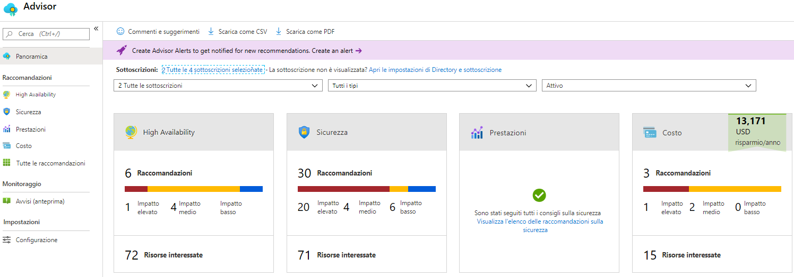
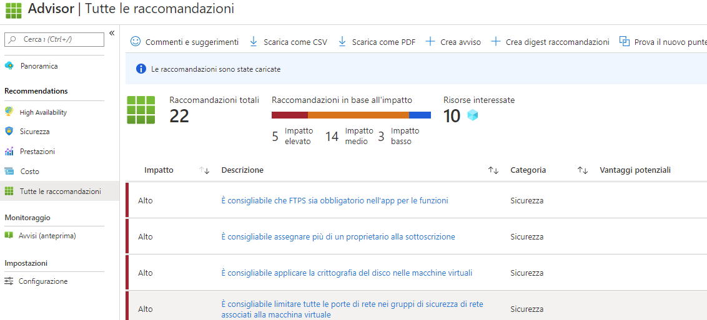

---
wts:
  title: 10. Creare una VM con PowerShell (10 min)
  module: 'Module 03: Describe core solutions and management tools'
ms.openlocfilehash: a6c6e26b535658ebb01beac8037adcb5c15dc6e8
ms.sourcegitcommit: 26c283fffdd08057fdce65fa29de218fff21c7d0
ms.translationtype: HT
ms.contentlocale: it-IT
ms.lasthandoff: 01/27/2022
ms.locfileid: "137907755"
---
# <a name="10---create-a-vm-with-powershell-10-min"></a>10. Creare una VM con PowerShell (10 min)

In questa procedura dettagliata verrà configurato Cloud Shell, verrà usato il modulo Azure PowerShell per creare un gruppo di risorse e una macchina virtuale, quindi verranno esaminati gli elementi consigliati di Azure Advisor. 

# <a name="task-1-configure-the-cloud-shell"></a>Attività 1: Configurare Cloud Shell 

In questa attività verrà configurato Cloud Shell. 

1. Accedere al [portale di Azure](https://portal.azure.com). ** Le credenziali di accesso si trovano nella scheda delle risorse (subito accanto alla scheda Istruzioni). **
2. Nel portale di Azure aprire **Azure Cloud Shell** facendo clic sull'icona nell'angolo in alto a destra.

    

3. Quando viene chiesto di selezionare **Bash** o **PowerShell**, selezionare **PowerShell**.

4. Nella schermata **Non sono state montate risorse di archiviazione**, selezionare **Mostra impostazioni avanzate**, quindi immettere le seguenti informazioni

    | Impostazioni | Valori |
    |  -- | -- |
    | Gruppo di risorse | **Creare un nuovo gruppo di risorse** |
    | Account di archiviazione (Creare un nuovo account di archiviazione e usare un nome che sia univoco a livello globale (ad esempio: cloudshellstoragemystorage )) | **cloudshellxxxxxxx** |
    | Condivisione file (creare nuova) | **shellstorage** |

5. Selezionare **Crea account di archiviazione**

# <a name="task-2-create-a-resource-group-and-virtual-machine"></a>Attività 2: Creare un gruppo di risorse e una macchina virtuale

In questa attività verranno creati un gruppo di risorse e una macchina virtuale con PowerShell.  

1. Assicurarsi che nel menu a discesa nell'angolo in alto a sinistra del riquadro Cloud Shell sia selezionato **PowerShell**.

2. Verificare il nuovo gruppo di risorse immettendo il comando nella finestra Powershell. Premere **Invio** per eseguire il comando.

    ```PowerShell
    Get-AzResourceGroup | Format-Table
    ```

3. Creare una macchina virtuale incollando il seguente comando nella finestra del terminale. 

    ```PowerShell
    New-AzVm `
    -ResourceGroupName "myRGPS" `
    -Name "myVMPS" `
    -Location "East US" `
    -VirtualNetworkName "myVnetPS" `
    -SubnetName "mySubnetPS" `
    -SecurityGroupName "myNSGPS" `
    -PublicIpAddressName "myPublicIpPS"
    ```
    
4. Quando richiesto, specificare il nome utente (**azureuser**) e la password (**Pa$$w0rd1234**) che verranno configurati come account amministratore locale in machines.azureadmin

5. Una volta creata la macchina virtuale, chiudere il riquadro Cloud Shell della sessione PowerShell.

6. Nel portale di Azure cercare **Macchine virtuali** e verificare che **myVMPS** sia in esecuzione. L'operazione potrebbe richiedere alcuni minuti.

    

7. Accedere alla nuova macchina virtuale ed esaminare le impostazioni in Panoramica e Rete per verificare che la distribuzione sia riuscita con le informazioni fornite. 

# <a name="task-3-execute-commands-in-the-cloud-shell"></a>Attività 3: Eseguire comandi in Cloud Shell

In questa attività si farà pratica con l'esecuzione dei comandi di PowerShell in Cloud Shell. 

1. Nel portale di Azure aprire **Azure Cloud Shell** facendo clic sull'icona nell'angolo in alto a destra.

2. Assicurarsi che nel menu a discesa nell'angolo in alto a sinistra del riquadro Cloud Shell sia selezionato **PowerShell**.

3. Recuperare le informazioni sulla macchina virtuale, come nome, gruppo di risorse, località e stato. Notare che lo stato è **in esecuzione**.

    ```PowerShell
    Get-AzVM -name myVMPS -status | Format-Table -autosize
    ```

4. Arrestare la macchina virtuale immettendo il seguente comando. 

    ```PowerShell
    Stop-AzVM -ResourceGroupName myRGPS -Name myVMPS
    ```
5. Quando richiesto, confermare l'azione scegliendo Sì. Attendere che venga inviato lo stato **Riuscito**.

6. Verificare lo stato della macchina virtuale. Lo stato dovrebbe ora essere **deallocata**. È anche possibile verificare lo stato della macchina virtuale nel portale. Chiudere Cloudshell.

    ```PowerShell
    Get-AzVM -name myVMPS -status | Format-Table -autosize
    ```

# <a name="task-4-review-azure-advisor-recommendations"></a>Attività 4: Esaminare le raccomandazioni di Azure Advisor

**Nota:** questa stessa attività viene eseguita nel lab Creare una VM con l'interfaccia della riga di comando di Azure. 

In questa attività verranno esaminate le raccomandazioni di Azure Advisor per la macchina virtuale. 

1. Nel pannello **Tutti i servizi** cercare e selezionare **Advisor**. 

2. Nel pannello **Advisor** selezionare **Panoramica**. Si noti che le raccomandazioni sono raggruppate in base ad Affidabilità, Sicurezza, Prestazioni e Costo. 

    

3. Selezionare **Tutte le raccomandazioni**, quindi esaminarle tutte, insieme alle azioni suggerite. 

    **Nota:** le raccomandazioni variano in base alle risorse in uso. 

    

4. È possibile scaricare le raccomandazioni in un file CSV o PDF. 

5. È anche possibile creare avvisi. 

6. Se si ha tempo, continuare a sperimentare con Azure PowerShell. 

Congratulazioni! È stato configurato Cloud Shell, è stata creata una macchina virtuale con PowerShell, sono stati provati i comandi di PowerShell e sono state visualizzate le raccomandazioni di Advisor.

**Nota**: per evitare costi aggiuntivi, è possibile rimuovere questo gruppo di risorse. Cercare e selezionare il gruppo di risorse, quindi fare clic su **Elimina gruppo di risorse**. Verificare il nome del gruppo di risorse e quindi fare clic su **Elimina**. Monitorare la pagina **Notifiche** per verificare l'avanzamento dell'eliminazione.
